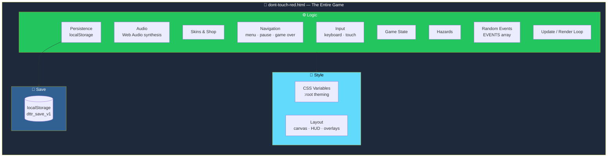
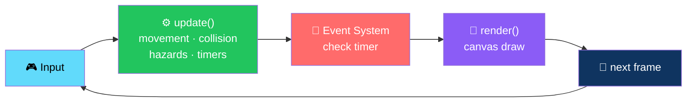
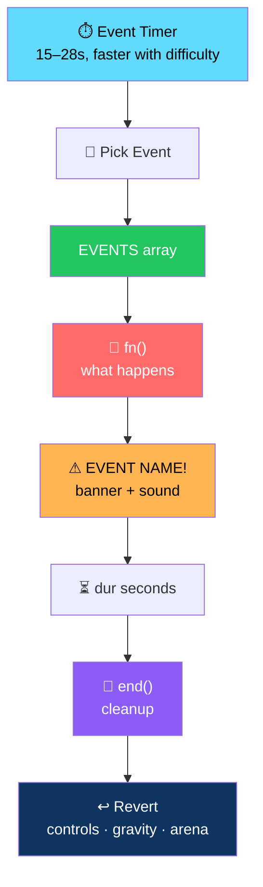

# 🔴 DON'T TOUCH THE RED

<div align="center">


**Avoid anything red. Collect coins. Survive as long as you can.**

*A polished, single-file browser arcade survival game — with random chaos events that keep things interesting.*

[🎮 How to Run](#-how-to-run-it) • [🕹️ Controls](#-controls) • [✨ Gameplay](#-gameplay-overview) • [🎲 Random Events](#-random-events) • [🏗️ Architecture](#️-architecture)

</div>

---

## 📖 Overview

**DON'T TOUCH THE RED** is a **polished, single-file browser arcade survival game**.

- 🔴 **Avoid anything red**
- 🪙 **Collect coins**
- ⏱️ **Survive as long as you can**
- 🎲 **Random chaos events keep things interesting**

### Core Idea

> **One file. Zero assets. Zero dependencies.**
>
> Graphics, sound, and logic are all generated in a single self-contained HTML file.

---

## 📁 Contents

```
dont-touch-red/
├── dont-touch-red.html   ← the entire game (open this file)
└── README.md             ← this file
```

> 💡 **There are no other dependencies, build steps, or external assets.**

---

## 🎮 How to Run It

1. **Unzip the archive**
2. **Double-click `dont-touch-red.html`** — or open it from your browser with **File → Open**
3. **Play.**

> ✅ **That's it** — no server, no install, no internet connection required.

### Optional: Host It

Works fine on any static web host:

- **Netlify**
- **GitHub Pages**
- **A plain Apache / nginx folder**

Just upload `dont-touch-red.html`.

---

## 🕹️ Controls

| Input | Action |
|-------|--------|
| **`W A S D`** or **Arrow Keys** | Move |
| **On-screen joystick** *(auto-shown on touch devices)* | Move |
| **`Esc`** or the **⏸ button** | Pause / Resume |

---

## ✨ Gameplay Overview

<div align="center">

| 🎯 Objective | ❤️ Lives |
|:---:|:---:|
| Survive as long as possible — score climbs continuously, plus bonus points for coins | 3 hearts (1 in Hard Mode) · touching red costs a heart and gives a brief invulnerability window with a flashing sprite |
| **🪙 Coins** | **📈 Difficulty** |
| Yellow coins spawn around the arena — collecting one adds to your score and to your permanent coin balance | Ramps up automatically over time — hazards spawn faster and move quicker the longer a run goes |

</div>

### 🎯 Objective

- **Survive as long as possible**
- **Score climbs continuously** the longer you're alive
- **Bonus points for coins**

### ❤️ Lives

- Start with **3 hearts** *(1 in Hard Mode)*
- **Touching anything red** costs a heart
- Gives you a **brief invulnerability window** *(flashing sprite)* so you can escape

### 🪙 Coins

- **Yellow coins** spawn around the arena
- Collecting one adds to:
  - Your **score**
  - Your **permanent coin balance** *(spendable in the Shop, kept between runs)*

### 📈 Difficulty

- **Ramps up automatically over time**
- Hazards spawn **faster** and move **quicker** the longer a run goes

---

## 🎲 Random Events

> **Every 15–28 seconds** *(more frequently as difficulty rises)* a random event fires — with an on-screen **⚠ EVENT NAME!** banner and a sound cue.

<div align="center">

| Event | What Happens |
|-------|--------------|
| 💣 **Falling Bombs** | A volley of red bombs drops from the top of the arena |
| ⚡ **Laser Walls** | Full-width / height red laser beams sweep back and forth |
| 📐 **Shrinking Arena** | The playable area temporarily contracts |
| 👾 **Red Enemies Spawning** | Bouncing red enemies roam the arena for a while |
| 🔄 **Reverse Controls** | Your movement inputs are inverted |
| 🌙 **Low Gravity** | A floaty movement-speed modifier |
| ⚡ **Speed Boost** | A temporary speed multiplier — helps you escape, but overshooting is easy |
| 🟥 **Giant Danger Zone** | A red zone grows from a point and lingers |
| 💥 **Multiple Hazards** | A "chaos" event that fires several hazard types at once |

</div>

> 💡 **Each event has its own duration and automatically reverts** — controls, gravity, arena size, etc. return to normal when it ends.

---

## 🎮 Game Modes

**Pick a mode from the main menu before pressing Play:**

| Mode | Description |
|------|-------------|
| **Classic Survival** | Standard 3 lives · standard difficulty ramp |
| **Endless Chaos** | Same core rules — events and hazards are the main draw for repeat runs |
| **Time Challenge** | A fixed **90-second run** — the goal is maximum score before time's up |
| **Hard Mode** | **1 life only** and a steeper starting difficulty curve for experienced players |

---

## 🎁 Progression, Shop & Cosmetics

<div align="center">

| 💰 Persistent Coins | 🎨 Character |
|:---:|:---:|
| Coins earned during runs persist between sessions *(saved to `localStorage`)* | Open **Character** from the main menu to equip any skin you've unlocked |
| **🛍️ Shop** | **⚖️ Fair by Design** |
| Spend coins on additional character skins and cosmetic trail effects | **Nothing purchased is pay-to-win** — cosmetics only. All gameplay-affecting items are available to everyone from the start |

</div>

---

## 🖥️ UI & Game States

**Four clean states** — **Menu → Playing → Paused → Game Over** — each with its own screen and **no dead ends**.

### 🏠 Menu

- **Play**
- **Game Mode**
- **Character**
- **Shop**
- **Settings**
- Your current **High Score** / **Coin balance**

### 🎮 In-Game HUD

- Live **score**
- **Survival time**
- **Coins collected this run**
- **Remaining hearts**
- A **pause button**
- **Event banners** appear at the top-center when a random event triggers

### ⏸️ Pause Screen

- **Resume** or return to the **Main Menu**
- **The run state is preserved while paused**

### 💀 Game Over Screen

- Final **score**
- **Survival time**
- **Coins collected**
- Your **all-time best score**
- A **"New Record!"** callout when you beat it
- **Retry** / **Main Menu** buttons

---

## 🔊 Audio

**All music and sound effects are generated live with the Web Audio API** — there are no external audio files to load, so the game works **completely offline**.

### Distinct Cues For

- 🪙 Coin pickups
- 💔 Taking damage
- ☠️ Dying
- ⚠️ Event triggers
- 🔘 Button presses

Plus a **light looping background melody**.

### Toggle Independently

- **Music**
- **Sound Effects**

From **Settings** — your choice is remembered.

---

## 💾 Saved Data

The game saves the following to your browser's **`localStorage`** *(key: `dttr_save_v1`)* — **nothing is sent anywhere**:

- **High score**
- **Coin balance**
- **Unlocked skins & trails** and your currently selected ones
- **Music / SFX on-off preference**
- Whether you've seen the **first-time tutorial**

### Full Reset

Clear your browser's **site data** for the page — or open it in a **private / incognito window**.

---

## 📱 Mobile & Responsive Support

<div align="center">

| Feature | Implementation |
|---------|---------------|
| **Canvas scaling** | Scales to fit any screen size while preserving its aspect ratio |
| **Touch joystick** | Automatically appears on touch-capable devices in place of the keyboard hint |
| **Safe areas** | Layout respects device safe areas (notches / home indicators) on modern phones |

</div>

---

## 🏗️ Architecture

### Everything in One File



### The Game Loop



### The Random Event System



### Design Principles

<div align="center">

| Principle | Implementation |
|-----------|---------------|
| **📄 One file, zero dependencies** | The whole game is one HTML file — portable, shareable, and works offline |
| **🎨 Everything generated at runtime** | Graphics, sound, and effects — no image files, no audio files |
| **🔊 Audio without assets** | All music and SFX synthesized with the Web Audio API |
| **🎲 Chaos by design** | Nine random events keep every run different, each with its own clean revert |
| **🧩 Data-driven events** | Each event is a `{ name, fn, dur, end }` entry in the `EVENTS` array — adding one is a one-line change |
| **⚖️ Fair cosmetics** | Nothing purchased is pay-to-win — all gameplay-affecting items are available to everyone |
| **💾 Progress without a backend** | `localStorage` under `dttr_save_v1` — nothing sent anywhere |
| **📱 Mobile-first** | Auto-shown touch joystick, safe-area-aware layout, scaled canvas |
| **🚫 No fake features** | Nine of eleven planned events are built. The two that aren't are listed in **Known Simplifications** |

</div>

---

## 📝 Known Simplifications

> **This build focuses on a fully playable, polished core experience.**
>
> **A couple of items from the original wishlist are intentionally simplified for this version, and would be natural next additions:**

<div align="center">

| Feature | Current State |
|---------|--------------|
| **Rotating arena** | Not yet implemented as a standalone event |
| **Disappearing floor tiles** | Not yet implemented as a standalone event |
| **Cosmetic trails** | Purchasable shop items with **basic visuals** rather than fully unique animated effects per item |
| **Death effects** | Same — basic visuals rather than fully unique per item |

</div>

> 💡 **The other nine events are fully implemented.**
>
> If you'd like either of those built out, or additional skins / modes added, just ask.

---

## 🎨 Customizing / Extending the Code

**Everything lives in `dont-touch-red.html`:**

### 🎨 CSS (`<style>` block)

- Controls **all visual styling**
- **CSS-variable-driven** — see `:root` — if you want to reskin colors quickly

### ⚙️ JavaScript (`<script>` block)

Organized into **clearly commented sections**:

1. **Persistence**
2. **Audio**
3. **Skins / Shop**
4. **Navigation**
5. **Input**
6. **Game State**
7. **Hazards**
8. **Random Events**
9. **Update / Render Loop**
10. **Pause / End Handling**

### ➕ Adding a New Random Event

**Add an entry to the `EVENTS` array** with:

```js
{
  name: "EVENT NAME",
  fn:   () => { /* what happens when it starts */ },
  dur:  10,                          // seconds
  end:  () => { /* cleanup when it finishes */ }
}
```

### ➕ Adding a New Hazard Type

1. Add a **`spawnX()` function**
2. Add a matching branch in the **`update()` collision loop**
3. Add a matching branch in the **`render()` drawing loop**

---

## 🗺️ Roadmap

### ✅ Current

- [x] Single-file, self-contained game
- [x] Works completely offline
- [x] Keyboard and touch joystick controls
- [x] Pause via `Esc` or the on-screen button
- [x] Continuous score based on survival time
- [x] Coin collection with bonus score and persistent balance
- [x] 3 hearts (1 in Hard Mode) with invulnerability window
- [x] Automatic difficulty ramp
- [x] **Nine random events** — bombs, laser walls, shrinking arena, red enemies, reverse controls, low gravity, speed boost, giant danger zone, multiple hazards
- [x] Event banners with sound cues
- [x] Four game modes — Classic, Endless Chaos, Time Challenge, Hard Mode
- [x] Persistent coin balance across sessions
- [x] Character skins and cosmetic trails
- [x] Shop with coin-spendable cosmetics
- [x] No pay-to-win — all gameplay items available to everyone
- [x] Four clean states — Menu → Playing → Paused → Game Over
- [x] Live HUD with score, time, coins, hearts, and pause
- [x] Pause preserves run state
- [x] Game Over with all-time best and "New Record!" callout
- [x] Fully synthesized Web Audio music and SFX
- [x] Independent Music / SFX toggles
- [x] `localStorage` persistence under `dttr_save_v1`
- [x] Canvas scales to any screen, preserving aspect ratio
- [x] Auto-shown touch joystick
- [x] Safe-area-aware layout
- [x] Data-driven event system — `{ name, fn, dur, end }`
- [x] CSS-variable theming

### 🔜 Future Ideas

- [ ] **Rotating arena** — as a standalone random event
- [ ] **Disappearing floor tiles** — as a standalone random event
- [ ] **Unique animated trails** — per cosmetic item
- [ ] **Unique death effects** — per cosmetic item
- [ ] Additional character skins
- [ ] Additional game modes
- [ ] Daily challenges with fixed seeds
- [ ] Online leaderboard
- [ ] Achievements
- [ ] Photo mode for shareable highlights

---

## 🤝 Contributing

Contributions are welcome. Please:

1. Fork the repository
2. **Keep it single-file** — no external build step, no bundler
3. **Keep it asset-free** — no image files, no audio files
4. **Use the `EVENTS` array for new events** — one entry, four fields
5. **Follow the hazard pattern** — `spawnX()` + update branch + render branch
6. **Preserve fairness** — no pay-to-win cosmetics, ever
7. Test on both desktop and mobile
8. Submit a Pull Request

### Guidelines

- **Never add a required external dependency** — the game must run from `file://`
- **Never require a build step** — `dont-touch-red.html` and nothing else
- **Never break `localStorage` compatibility** — existing saves must keep working
- **Never auto-unlock cosmetics that were meant to be earned**
- **Never present a stub as a feature** — the **Known Simplifications** section is the standard

---

## 📜 License

MIT — see [LICENSE](LICENSE) for details.

---

## 🙏 Acknowledgments

- **Canvas 2D** — for making a full arcade game possible in one file
- **Web Audio API** — for a game with zero audio files
- **Every game that ever made you scream "DON'T TOUCH THE RED!"** — this one's for you

---

<div align="center">

### 🔴 DON'T TOUCH THE RED.

**Avoid the red. Collect coins. Survive.**

**One file. Zero assets. Zero dependencies.**

<br>

### Good luck — and good luck not touching the red. 🔴

<br>

⭐ If you enjoyed this game, consider giving it a star.

<br>

[⬆ Back to Top](#-dont-touch-the-red-)

</div>
